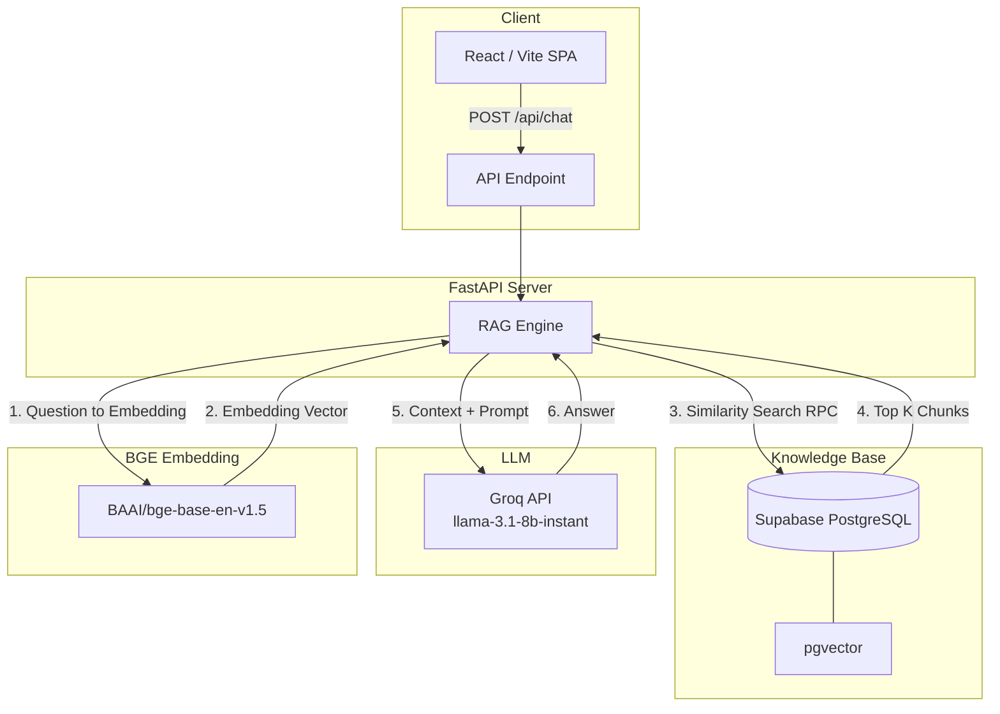

# PolicyPilot 🏛️

**PolicyPilot** is a simple, intelligent, and beautifully designed RAG-based chatbot that allows employees to ask questions about company policies using natural language. It instantly retrieves relevant sections from internal documents and uses a Large Language Model to answer the questions contextually and accurately.


## 🎨 Design Philosophy
PolicyPilot departs from generic SaaS interfaces. It embraces a flat, 2D illustration style utilizing a harmonious color palette:
- **Parchment (#F4EBD9)** for paper-like backgrounds
- **Mahogany Wood (#3A2318)** for high-contrast typography and hard borders
- **Banker's Green (#2A7E43)** for primary accents and headers
- **Lamp Glow (#FCEB9C)** for user chat highlights
- **Cold Tea Blue (#4B6973)** for technical/code block accents

The interface features bold, unblurred drop-shadows and pairs the warm **Merriweather** serif font with the technical **JetBrains Mono**.

## 🏗️ Architecture Diagram



## 🚀 How It Works

1. **Knowledge Ingestion**: The `scripts/ingest_knowledge.py` script parses Markdown files from the `knowledge/` directory, chunks them logically by headers, generates 768-dimensional vector embeddings via `BAAI/bge-base-en-v1.5`, and uploads them to a Supabase `knowledge_chunks` table using `pgvector`.
2. **Retrieval**: When an employee asks a question, the FastAPI backend embeds the query and calls a Supabase RPC function (`match_knowledge_chunks`) to calculate cosine similarities. It returns the top relevant policy sections.
3. **Generation**: The retrieved context and the user's question are compiled into a strict prompt and sent to Groq's Llama 3.1 8B model. The LLM is explicitly instructed to never hallucinate and only answer based on the provided company context.
4. **Presentation**: The response, along with exact source citations, is presented to the user in the React frontend.

## 🛠️ Quick Start

### 1. Database Setup (Supabase)
Run the SQL files located in `supabase/migrations/` sequentially in your Supabase SQL Editor:
1. `001_enable_pgvector.sql`
2. `002_create_knowledge_chunks.sql`
3. `003_create_match_function.sql`

*Note: After running the migrations, you may need to reload the Supabase schema cache:*
```sql
NOTIFY pgrst, 'reload schema';
```

### 2. Environment Variables
Create a `.env` file in the project root:
```env
SUPABASE_URL=your_supabase_url
SUPABASE_SERVICE_ROLE_KEY=your_service_role_key
GROQ_API_KEY=your_groq_key
```

### 3. Launching
You can launch both the background ingestion and the API server by running:
```bash
.\run_backend.bat
```

To start the frontend UI:
```bash
cd frontend
npm install
npm run dev
```
